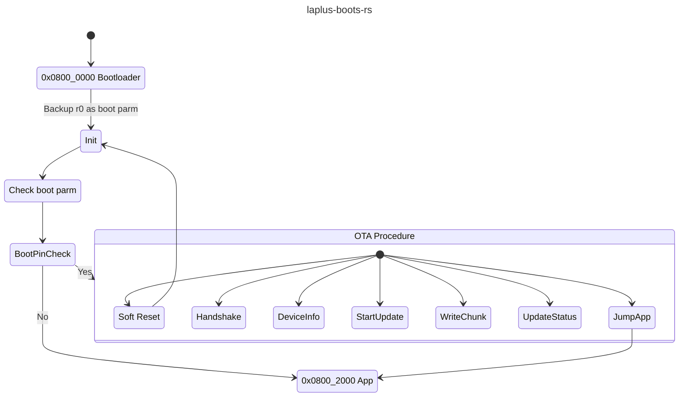

<!--
SPDX-FileCopyrightText: © 2025 Jinwoo Park (pmnxis@gmail.com)

SPDX-License-Identifier: MIT OR Apache-2.0
-->

# `laplus-boots-rs`

 🐦‍⬛👢🦀

### **Rust Embedded Firmware Bootloader Proof of Concept**
- Receives ChaCha20-encrypted binary data over UART for firmware updates.  
- Targets **STM32G030C8**[1](#footnote_1) (64KiB Flash), utilizing only **8KiB** for the bootloader, maximizing the remaining **56KiB** for firmware storage.
- Due to size constraints, it is a bare-metal Rust embedded implementation, leveraging **Embassy-rs**[2](#footnote_2)' STM32 HAL. Relies on panic_abort (defmt and RTT are cannot be utilized).

### State Diagram

## Footnote
<a name="footnote_1">1</a> `STM32G030C8` is STMicroelectronics' MCU with ARM-Cortex M0+ , 64KiB Flash and 8KiB SRAM.  
( https://www.st.com/en/microcontrollers-microprocessors/stm32g030c8.html )   

<a name="footnote_2">2</a> `embassy-rs` is rust embedded framework 
( https://github.com/embassy-rs/embassy )  
